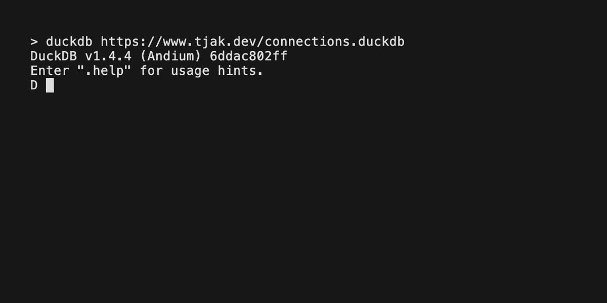

# connections.duckdb

**Be wary**: this README contains **spoilers** for the New York Times
Connections puzzle for 2026-02-26 and 2026-02-27 in America/New_York time.

[DuckDB][] is already more fun than a barrel of ducks. But sometimes the toil
of crunching entities leaves you wanting a little side quest, a diversion from
your data destination. What if you could take a break and play the [New York
Times Connections] puzzle, all without leaving your DuckDB REPL?

Introducing the first database that lets you play the New York Times
Connections puzzle: `connections.duckdb`.

<details open>
<summary>Demo (approximately 15 seconds)</summary>


## How to play

Start DuckDB with the database loaded, either by downloading a release or using
the convenient hosted version:

```bash
$ duckdb https://www.tjak.dev/connections.duckdb
```

From within a REPL:

```duckdb
D ATTACH 'https://www.tjak.dev/connections.duckdb' as connections (READ_ONLY);
D USE connections;
```

See today's words:

```duckdb
D select word from todays_words;
┌────────────┐
│    word    │
│  varchar   │
├────────────┤
│ JUDAS      │
│ DRILL      │
│ QUALITY    │
│ BUTTERFLY  │
│ FRENCH     │
│ BENCH      │
│ AIR        │
│ RIPPLE     │
│ SNAKE      │
│ SNOWBALL   │
│ TRAITOR    │
│ MANNER     │
│ DOMINO     │
│ PRINTING   │
│ IMPRESSION │
│ TURNCOAT   │
├────────────┤
│  16 rows   │
└────────────┘
```

See today's puzzle formatted in a 4x4 grid:

```duckdb
D select * from todays_puzzle;
┌─────────┬──────────┬────────────┬───────────┐
│  word1  │  word2   │   word3    │   word4   │
│ varchar │ varchar  │  varchar   │  varchar  │
├─────────┼──────────┼────────────┼───────────┤
│ JUDAS   │ DRILL    │ QUALITY    │ BUTTERFLY │
│ FRENCH  │ BENCH    │ AIR        │ RIPPLE    │
│ SNAKE   │ SNOWBALL │ TRAITOR    │ MANNER    │
│ DOMINO  │ PRINTING │ IMPRESSION │ TURNCOAT  │
└─────────┴──────────┴────────────┴───────────┘
```

Check a guess of four words which may make a category.  If incorrect, the query
will return an `"incorrect"` status as well as the colored tiles representing
the categories of your guess. If correct, the query will return a `"correct"`
status and give you the category's title.

```duckdb
D SELECT * FROM guess_category_today(['JUDAS', 'DRILL', 'QUALITY', 'BUTTERFLY']);
┌───────────┬──────────┬──────────┐
│  status   │  emoji   │ category │
│  varchar  │ varchar  │ varchar  │
├───────────┼──────────┼──────────┤
│ incorrect │ 🟨🟪🟩🟦 │ NULL     │
└───────────┴──────────┴──────────┘
D SELECT * FROM guess_category_today(['IMPRESSION', 'AIR', 'QUALITY', 'MANNER']);
┌─────────┬──────────┬──────────┐
│ status  │  emoji   │ category │
│ varchar │ varchar  │ varchar  │
├─────────┼──────────┼──────────┤
│ correct │ 🟩🟩🟩🟩 │ AURA     │
└─────────┴──────────┴──────────┘┘
```

You're on your own to keep the score and keep yourself honest. Check back soon
for automated scorekeeping!

## How to cheat

See the categories for today's puzzle:

```duckdb
D select title as category, unnest(cards).content as word from todays_categories;
┌───────────────────────────────────┬────────────┐
│             category              │    word    │
│              varchar              │  varchar   │
├───────────────────────────────────┼────────────┤
│ BACKSTABBER                       │ JUDAS      │
│ BACKSTABBER                       │ SNAKE      │
│ BACKSTABBER                       │ TRAITOR    │
│ BACKSTABBER                       │ TURNCOAT   │
│ AURA                              │ AIR        │
│ AURA                              │ IMPRESSION │
│ AURA                              │ MANNER     │
│ AURA                              │ QUALITY    │
│ KINDS OF CHAIN REACTION "EFFECTS" │ BUTTERFLY  │
│ KINDS OF CHAIN REACTION "EFFECTS" │ DOMINO     │
│ KINDS OF CHAIN REACTION "EFFECTS" │ RIPPLE     │
│ KINDS OF CHAIN REACTION "EFFECTS" │ SNOWBALL   │
│ ___ PRESS                         │ BENCH      │
│ ___ PRESS                         │ DRILL      │
│ ___ PRESS                         │ FRENCH     │
│ ___ PRESS                         │ PRINTING   │
├───────────────────────────────────┴────────────┤
│ 16 rows                              2 columns │
└────────────────────────────────────────────────┘
```

See the categories for the puzzle from date `2026-02-26`:

```duckdb
D select title as category, unnest(cards).content as word from connections_categories('2026-02-26');
┌──────────────────────────┬───────────────────┐
│         category         │       word        │
│         varchar          │      varchar      │
├──────────────────────────┼───────────────────┤
│ PIVOTAL POINT            │ CROSSROADS        │
│ PIVOTAL POINT            │ LANDMARK          │
│ PIVOTAL POINT            │ MILESTONE         │
│ PIVOTAL POINT            │ WATERSHED         │
│ GREEN THINGS             │ GRASSHOPPER       │
│ GREEN THINGS             │ SHAMROCK          │
│ GREEN THINGS             │ STATUE OF LIBERTY │
│ GREEN THINGS             │ WASABI            │
│ ELEMENTS OF JOKE-TELLING │ CALLBACK          │
│ ELEMENTS OF JOKE-TELLING │ PUNCHLINE         │
│ ELEMENTS OF JOKE-TELLING │ SETUP             │
│ ELEMENTS OF JOKE-TELLING │ TIMING            │
│ "___ PLEASE"             │ ATTENTION         │
│ "___ PLEASE"             │ CHECK             │
│ "___ PLEASE"             │ DRUMROLL          │
│ "___ PLEASE"             │ PRETTY            │
├──────────────────────────┴───────────────────┤
│ 16 rows                            2 columns │
└──────────────────────────────────────────────┘
```

## Play historical games

Play a selection of historical games using these table macros.  The `ymd`
argument should be an ISO 8601-formatted date like `"2026-02-26"`.
- `SELECT * FROM connections_words(ymd)`
- `SELECT * FROM connections_puzzle(ymd)`
- `SELECT * FROM guess_category_date(ymd, guess)`


## How it works (data disclaimer)

`connections.duckdb` contains no data from the New York Times. Instead, it
contains code, in the form of DuckDB-flavored SQL macros and views, which
provide convenient access to the game's publicly accessible data feed through
DuckDB's `read_json` function. Invoking this code from a DuckDB connection
attached to the database allows the connected user or agent to play the
Connections game locally using data resident in-memory.  User guesses are not
sent to the New York Times.

## FAQ

### Can I use this from the browser with DuckDB WASM?

Unfortunately, no: the New York Times's API endpoint does not allow for
cross-origin resource sharing.  You can open the connections.duckdb database,
but all queries will fail.

## Development tasks

There is a small test suite written in Python.  To run it:

```
uv run pytest
```

Or:

```
make test
```

# copyright

source code (c) 2026 Tom Jakubowski, published under the MIT license

I am a happy player and admirer of the [Connections] game which is owned by the
New York Times and edited by Wyna Liu.

[DuckDB]: https://duckdb.org/
[New York Times Connections]: https://www.nytimes.com/games/connections
[Connections]: https://www.nytimes.com/games/connections
